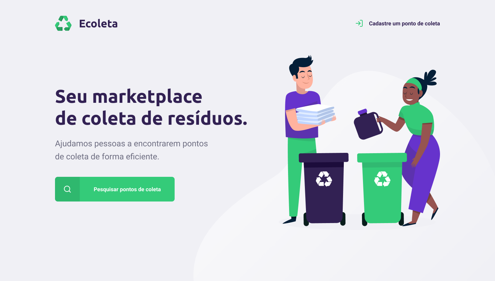

<h1 align="center">
    
</h1>

<p align="left">
 

  
</p>

<br>

<p align="center">
  
</p>

## Tecnologias

Projeto desenvolvido com as tecnologias:

- [Node.js](https://nodejs.org/en/)
- [Express](https://expressjs.com/pt-br/)
- [JSON Server](https://github.com/typicode/json-server)
- [Nunjucks](https://mozilla.github.io/nunjucks/)
- [Axios](https://axios-http.com/)

## Projeto

Ecoleta é um projeto de um marketplace fictício onde pontos de coleta podem ser exibidos de acordo com a cidade selecionada.

Este projeto foi desenvolvido durante o mês de Junho/2020 como parte da Next Level Week Starter da Rockeseat.

## Layout

Você pode visualizar o layout fornecido [nesse link](<https://www.figma.com/file/Byw4X5etg8VCmezueyhzkC/Ecoleta-(Starter)?node-id=136%3A546>).

## 🚀 Instalação e Uso

### Pré-requisitos

- [Node.js](https://nodejs.org/) (versão 14+)
- npm ou yarn

### Instalação

```bash
# Clone o repositório
git clone https://github.com/tatishinoda/nextlevelweek.git

# Entre no diretório
cd nextlevelweek

# Instale as dependências
npm install
```

### Rodando o Projeto

#### Modo Desenvolvimento (Recomendado)

Inicia o Express + json-server simultaneamente:

```bash
npm run dev
```

O projeto estará disponível em:

- 🌐 **Aplicação**: http://localhost:3000
- 📊 **API/Banco**: http://localhost:3001

#### Modo Produção

```bash
npm start
```

Para usar json-server em produção, inicie em outro terminal:

```bash
npx json-server --watch db.json --port 3001
```

## 📁 Estrutura do Projeto

```
nextlevelweek/
├── src/
│   ├── index.js                 # Ponto de entrada
│   ├── server.js                # Configuração do Express
│   ├── database/
│   │   ├── db.js                # Cliente para json-server
│   │   └── seed.js              # Inicialização do banco
│   └── views/                   # Templates HTML (Nunjucks)
├── public/
│   ├── assets/                  # Imagens
│   └── styles/                  # Arquivos CSS
├── api/                         # [REMOVIDO] Configurações da Vercel
├── db.json                      # Banco de dados (json-server)
├── package.json
└── README.md
```

## 🔄 Rotas da Aplicação

### Frontend

- `GET /` - Página inicial
- `GET /create-point` - Formulário para criar ponto de coleta
- `POST /savepoint` - Salvar novo ponto de coleta
- `GET /search?search=cidade` - Buscar pontos por cidade

### Backend (JSON Server)

- `GET /places` - Listar todos os pontos
- `POST /places` - Criar novo ponto
- `GET /places/:id` - Buscar ponto por ID
- `PUT /places/:id` - Atualizar ponto
- `DELETE /places/:id` - Deletar ponto

## 📝 Estrutura de um Ponto de Coleta

```json
{
   "id": 1,
   "image": "URL da imagem",
   "name": "Nome do ponto",
   "address": "Endereço completo",
   "address2": "Número/Complemento",
   "state": "Estado",
   "city": "Cidade",
   "items": "Tipos de resíduos aceitos"
}
```

## 💾 Banco de Dados

O projeto utiliza **json-server** para armazenar dados em arquivo JSON. Os dados iniciais estão em `db.json` na raiz do projeto.

- Dados persistem automaticamente quando novos pontos são criados
- Edite `db.json` diretamente para adicionar/modificar dados manualmente
- Compatível com qualquer cliente HTTP (Insomnia, Postman, etc.)

## 🆕 Recentes Mudanças

- ✅ Removido deploy da Vercel
- ✅ Migrado de SQLite para json-server
- ✅ Adicionado Axios para requisições HTTP
- ✅ Configuração local simplificada

## 📄 Licença

Este projeto está sob a licença MIT.
